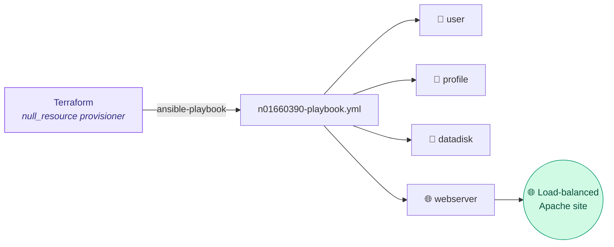

<div align="center">

# Ansible Configuration — Linux Web Tier

### CCGC 5502 Automation Project &nbsp;|&nbsp; Configuration as Code

Four parameterized roles that configure the three Linux VMs after Terraform builds them — users, profile, data disks, and a load-balanced Apache site. Run automatically by the Terraform `null_resource` provisioner, non-interactively.


</div>

---

## 🎯 What this does

The playbook runs against all Linux inventory nodes and applies four roles in order:

| Role | Purpose |
|---|---|
| 👤 `user-n01660390` | Creates the `cloudadmins` group + `user100/200/300`, adds them to `cloudadmins` and `wheel`, generates passwordless SSH keys |
| 📝 `profile-n01660390` | Appends a test block and `export TMOUT=1500` to `/etc/profile` system-wide |
| 💾 `datadisk-n01660390` | Partitions each 10 GB data disk → 4 GB XFS on `/part1`, 5 GB EXT4 on `/part2`, persistently mounted |
| 🌐 `webserver-n01660390` | Installs Apache, drops a per-node `index.html` with that node's FQDN, sets `0444`, starts the service via a handler, enables it on boot |

## 🗺️ How it fits together



Terraform passes the VM FQDNs as an inline inventory, so no static `hosts` file or manual step is needed — that's what makes provisioning 100% non-interactive.

## 📁 Structure

```
.
├── n01660390-playbook.yml          # lists all four roles, targets Linux nodes
├── ansible.cfg                     # host_key_checking = False, remote_user, etc.
└── roles/
    ├── user-n01660390/
    │   ├── tasks/main.yml          # group, users (loop), wheel/cloudadmins, ssh keys
    │   └── vars/main.yml           # user list, group names
    ├── profile-n01660390/
    │   ├── tasks/main.yml          # blockinfile / lineinfile on /etc/profile
    │   └── vars/main.yml           # TMOUT value, comment text
    ├── datadisk-n01660390/
    │   ├── tasks/main.yml          # parted, filesystem, mount (loop over disks)
    │   ├── handlers/main.yml
    │   └── vars/main.yml           # partition sizes, fs types, mount points
    └── webserver-n01660390/
        ├── tasks/main.yml          # install apache, deploy index.html, perms
        ├── handlers/main.yml       # restart apache
        ├── templates/index.html.j2 # shows {{ ansible_fqdn }}
        └── vars/main.yml           # package name, docroot
```

## 🚀 Running it

Normally you don't run this directly — `terraform apply` triggers it. To run it standalone for testing:

```bash
# inline inventory (comma = single host list); key-based, no prompts
ansible-playbook -i 'vm1.fqdn,vm2.fqdn,vm3.fqdn,' \
  -u n01660390 --private-key ~/.ssh/id_rsa \
  n01660390-playbook.yml
```

> [!NOTE]
> `ANSIBLE_HOST_KEY_CHECKING=False` (set in `ansible.cfg` or the environment) is what lets the first connection succeed without an interactive "accept host key?" prompt — required for hands-off provisioning.

## ✅ Validation (Phase V)

```bash
# log in as the new user with NO password/passphrase prompt
ssh -i ./user100_key user100@<vm1 fqdn>
tail -4 /etc/profile                       # TMOUT + test block present
tail -4 /etc/passwd                        # user100/200/300 exist
grep -E 'cloudadmins|wheel' /etc/group     # group membership
df -Th                                     # /part1 (xfs) and /part2 (ext4) mounted
```

Then hit the load balancer FQDN in a browser and refresh every few seconds — the page should rotate across vm1 / vm2 / vm3.

## 🔑 Idempotency & handlers

- All tasks use idempotent modules (`user`, `parted`, `filesystem`, `mount`, `blockinfile`) — re-running the playbook makes no changes once converged.
- Apache is started/restarted **via a handler**, so the service only bounces when its config actually changes (per spec requirement).

---

<div align="center">
<sub>CCGC 5502 Automation · pairs with the terraform-assignment repo</sub>
</div>
