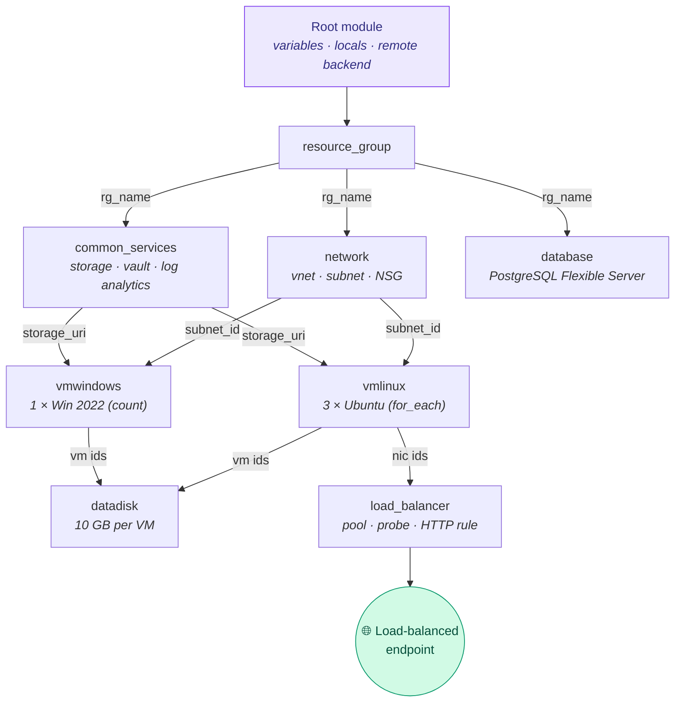

<div align="center">

# Azure Infrastructure with Terraform

### CCGC 5502 &nbsp;|&nbsp; Infrastructure as Code

A modular Terraform configuration that builds a complete Azure environment — network, Linux & Windows VMs, a load balancer, managed disks, and a PostgreSQL database — from a single `terraform apply`.


</div>

---

## 🏗️ What gets deployed

| Resource | Details |
|---|---|
| 🌐 Virtual network | `10.0.0.0/16` with one subnet + NSG (SSH, RDP, WinRM, HTTP) |
| 🐧 3 × Linux VMs | Ubuntu 22.04 LTS, `Standard_B1ms`, SSH-key auth, via `for_each` |
| 🪟 1 × Windows VM | Windows Server 2022, antimalware extension, via `count` |
| ⚖️ Load balancer | Standard SKU — frontend IP, backend pool, health probe, HTTP rule |
| 💾 Data disks | One 10 GB managed disk attached to every VM |
| 🐘 PostgreSQL | Flexible Server, cheapest burstable tier (`B_Standard_B1ms`) |
| 📦 Shared services | Storage account, Recovery Services vault, Log Analytics |

The three Linux VMs sit behind the load balancer; browse its public address after deploy:

```
http://<humber_id>-lb.<region>.cloudapp.azure.com
```

## 🗺️ Architecture



Every arrow is a module **output feeding another module's input** — Terraform derives the build order from these references automatically. No hardcoded dependencies.

## 🚀 Quick start

```bash
# 1. Log in and pick your subscription
az login

# 2. Create the remote-state backend (skip if it exists; or delete backend.tf for local state)
az group create -n tfstaten01660390RG -l canadacentral
az storage account create -n tfstaten01660390sa -g tfstaten01660390RG -l canadacentral --sku Standard_LRS
az storage container create -n tfstatefiles --account-name tfstaten01660390sa

# 3. Configure your values
cp terraform.tfvars.example terraform.tfvars   # set subscription_id + admin_password

# 4. SSH keys must exist for the Linux VMs
ls ~/.ssh/id_rsa.pub || ssh-keygen

# 5. Ship it
terraform init
terraform validate
terraform plan
terraform apply
```

## 📁 Project structure

```
.
├── providers.tf            # azurerm ~> 4.0
├── backend.tf              # remote state in Azure Blob Storage
├── variables.tf            # all input knobs (sizes, counts, names, region)
├── main.tf                 # locals + orchestration of 8 child modules
├── outputs.tf              # FQDNs, IPs, IDs, LB address
└── modules/
    ├── rgroup-n01660390/           # resource group
    ├── network-n01660390/          # vnet, subnet, NSG + rules
    ├── common_services-n01660390/  # storage, vault, log analytics
    ├── vmlinux-n01660390/          # 3 Ubuntu VMs
    ├── vmwindows-n01660390/        # Windows VM + antimalware
    ├── datadisk-n01660390/         # managed disks + attachments
    ├── loadbalancer-n01660390/     # complete Standard LB
    └── database-n01660390/         # PostgreSQL Flexible Server
```

## 🔧 What was fixed (June 2026 revival)

This repo was written in 2024. Azure moved on; the code was repaired and modernized.

### Why the repo wouldn't even clone on Windows
The original contained WSL metadata files named like `main.tf:Zone.Identifier` — colons are illegal in Windows filenames, so checkout failed. Those files are gone now. To replace the old repo content:

```bash
git init -b main && git add . && git commit -m "Fix and modernize"
git remote add origin https://github.com/sam51019/terraform-assignment.git
git push -f origin main
```

### ☁️ Retired Azure services → replaced

| Was (2024) | Status | Now |
|---|---|---|
| PostgreSQL Single Server | retired Mar 2025 | **Flexible Server** |
| Basic / Dynamic public IPs | retired Sep 2025 | **Standard / Static** |
| Basic load balancer | retired Sep 2025 | **Standard** |
| CentOS 7.9 image | EOL, gone from Marketplace | **Ubuntu 22.04 LTS** |
| Windows Server 2016 | out of mainstream support | **Windows Server 2022** |
| azurerm `~> 3.0.0` | ancient | **`~> 4.0`** (needs `subscription_id`) |

### 🐛 Bugs fixed

- **Plan-time count error** — disk count was derived from VM IDs (unknowable at plan time → `count cannot be determined until apply`). Now computed from variables in `locals`.
- **Crash at `windows_vm_count = 0`** — antimalware extension was hardcoded to VM `[0]`; now one per VM via `count`.
- **Wrong FQDN output** — returned `domain_name_label` instead of the real FQDN.
- **🔒 Plaintext password committed** — now a `sensitive` variable supplied via gitignored `terraform.tfvars`.
- **Empty load balancer** — was just a bare `azurerm_lb`; now a complete LB with frontend, backend pool, probe, and rule, with the Linux NICs attached.
- **Dead code removed** — unattached disk, duplicate output, variables pointing at another student's subscription.

## ✅ Post-deploy validation

```bash
terraform state list | nl     # inventory of everything created
terraform output              # FQDNs and IPs
ssh -i ~/.ssh/id_rsa n01660390@<vm fqdn>
curl http://<lb fqdn>
```

> [!WARNING]
> **Destroy when done** — `terraform destroy`. Four VMs + a database bill real money overnight.

---

<div align="center">
<sub>CCGC 5502 · Humber College · originally 2024, modernized 2026</sub>
</div>
